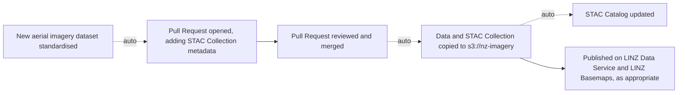
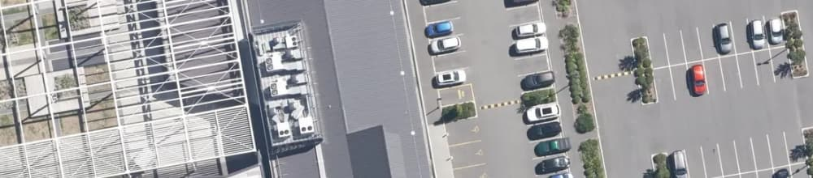
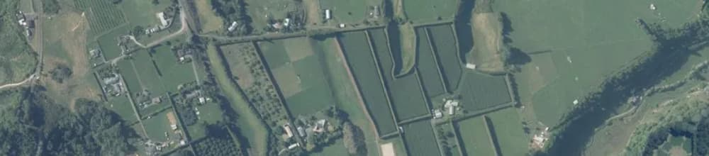
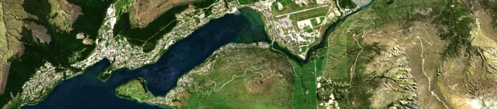
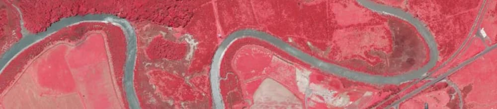
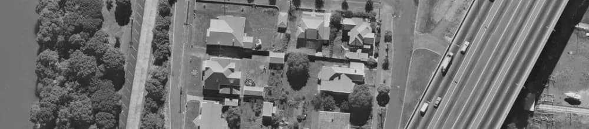
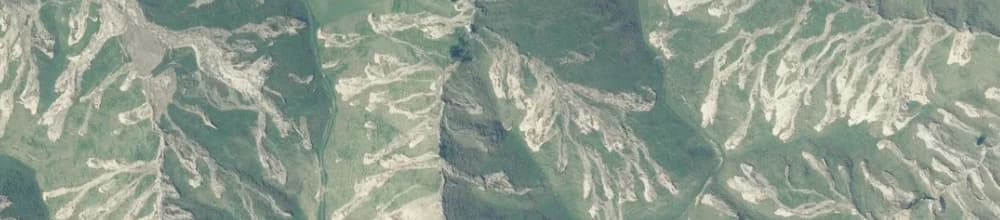

# New Zealand Imagery

[](https://registry.opendata.aws/nz-imagery/)
[](https://radiantearth.github.io/stac-browser/#/external/nz-imagery.s3-ap-southeast-2.amazonaws.com/catalog.json?.language=en)
[](https://developmentseed.org/stac-map/?href=https://nz-imagery.s3.ap-southeast-2.amazonaws.com/catalog.json)

Toitū Te Whenua Land Information New Zealand makes New Zealand's most up-to-date publicly owned aerial imagery freely available to use under an open licence. You can access this through the [LINZ Data Service](https://data.linz.govt.nz/data/category/aerial-photos/?s=n), [LINZ Basemaps](https://basemaps.linz.govt.nz/#@-41.8899962,174.0492437,z5) or the [Registry of Open Data on AWS](https://registry.opendata.aws/nz-imagery/).

This repository contains a copy of the [STAC](https://stacspec.org/) Collection metadata for each aerial imagery dataset, as well as some guidance documentation.

When a new aerial imagery dataset is published by Toitū Te Whenua Land Information New Zealand, the first step is always that a new Pull Request is opened on this repository, adding a STAC Collection for the new dataset. When this Pull Request is reviewed and merged, a data copying task will automatically be kicked off that moves the data and metadata for that new dataset from internal storage into the `s3://nz-imagery` public bucket. From here, the dataset may also be published on the LINZ Data Service and/or LINZ Basemaps. The top-level [STAC Catalog](https://nz-imagery.s3-ap-southeast-2.amazonaws.com/catalog.json) is also updated to link to the new dataset after the copy task completes.



## Quickstart

Browse the archive with [STAC Browser](https://radiantearth.github.io/stac-browser/#/external/nz-imagery.s3-ap-southeast-2.amazonaws.com/catalog.json) or access the catalog directly [https://nz-imagery.s3-ap-southeast-2.amazonaws.com/catalog.json](https://nz-imagery.s3-ap-southeast-2.amazonaws.com/catalog.json)

## Data Access

Toitū Te Whenua Land Information New Zealand owns and maintains a public bucket which is sponsored and shared via the [Registry of Open Data on AWS](https://registry.opendata.aws/nz-imagery/) `s3://nz-imagery` in `ap-southeast-2`.

Using the [AWS CLI](https://aws.amazon.com/cli/) anyone can access all of the imagery specified in this repository.

```
aws s3 ls --no-sign-request s3://nz-imagery/
```

For more information on interacting with the metadata and data in `s3://nz-imagery`, see further guidance:

- [Tools](docs/tools.md) covers some of the STAC ecosystem tools that can be used to interact with our STAC Catalog.
- [Usage](docs/usage.md) shows how TIFFs can be interacted with from S3 using GDAL, QGIS, etc.

## Data Overview

The `s3://nz-imagery` bucket comprises of a variety of different imagery types, captured for different purposes. [Naming](docs/naming.md) covers the `s3://nz-imagery` bucket structure.

### Urban Aerial Photos

Generally procured to better specifications (e.g. higher resolution) than other imagery types but with smaller town and city scale coverage. Procured and owned by the local territorial authority.

     
   Example: **Waimakariri 0.04m Urban Aerial Photos (2025)** | [STAC Collection](https://nz-imagery.s3-ap-southeast-2.amazonaws.com/canterbury/waimakariri_2025_0.04m/rgb/2193/collection.json) | [LINZ Basemaps](https://basemaps.linz.govt.nz/@-43.2913856,172.6032637,z17.75?i=waimakariri-2025-0.04m) | [LINZ Data Service](https://data.linz.govt.nz/layer/122655-waimakariri-004m-urban-aerial-photos-2025/)

### Rural Aerial Photos

Datasets that provide regional coverage are procured according to the [National Aerial Imagery Base Specification](https://www.linz.govt.nz/products-services/data/types-linz-data/aerial-imagery/national-imagery-base-specification) and are typically 20-30cm resolution.

     
   Example: **Bay of Plenty West 0.2m Rural Aerial Photos (2024-2025)** | [STAC Collection](https://nz-imagery.s3-ap-southeast-2.amazonaws.com/bay-of-plenty/bay-of-plenty_2024_0.2m/rgb/2193/collection.json) | [LINZ Basemaps](https://basemaps.linz.govt.nz/@-37.8401749,176.0642663,z14.82?i=bay-of-plenty-2024-0.2m) | [LINZ Data Service](https://data.linz.govt.nz/layer/120065-bay-of-plenty-west-02m-rural-aerial-photos-2024-2025/)

### Annual Cloudfree Satellite Imagery Mosaics

Annual satellite imagery mosaics are created from data from the European Space Agency's Sentinel-2 satellites. These are cloudfree mosaics comprising data collected over several months. See `s3://nz-imagery/new-zealand/`.

     
   Example: **New Zealand 10m Satellite Imagery (2024-2025)** | [STAC Collection](https://nz-imagery.s3-ap-southeast-2.amazonaws.com/new-zealand/new-zealand_2024-2025_10m/rgb/2193/collection.json) | [LINZ Basemaps](https://basemaps.linz.govt.nz/@-45.0334616,168.6989573,z11.64?i=new-zealand-2024-2025-10m) | [LINZ Data Service](https://data.linz.govt.nz/layer/123125-new-zealand-10m-satellite-imagery-2024-2025/)

### Near-Infrared Aerial Photos

The addition of a near-infrared band is required under the base specification and commonly included in other imagery procurements as well. RGB TIFFs and Near-Infrared TIFFs are published as two separate data products for surveys where near-infrared data is available.

     
   Example: **Auckland 0.075m Near-Infrared Aerial Photos (2024-2025)** | [STAC Collection](https://nz-imagery.s3-ap-southeast-2.amazonaws.com/auckland/auckland_2024_0.075m/rgbnir/2193/collection.json) | *Not currently published on LINZ Basemaps or the LINZ Data Service*

### Historical Scanned Aerial Imagery

From 2014 to 2023, Toitū Te Whenua Land Information New Zealand led a collaborative programme to digitise film negatives in the [Crown Aerial Film Library](https://www.linz.govt.nz/products-services/data/types-linz-data/aerial-imagery/historical-aerial-imagery). In some cases these have then also been georeferenced, orthorectified and made available in `s3://nz-imagery`. All scanned aerial imagery includes a survey number reference starting with `SN` in its title.

     
   Example: **Auckland 0.04m SN2714 (1974)** | [STAC Collection](https://nz-imagery.s3-ap-southeast-2.amazonaws.com/auckland/auckland_sn2714_1974_0.04m/rgb/2193/collection.json) | [LINZ Basemaps](https://basemaps.linz.govt.nz/@-36.8245334,174.7473735,z17.19?i=auckland-sn2714-1974-0.04m) | *Not currently published on the LINZ Data Service*

### Emergency Response Imagery

Some imagery has been captured to assist with [emergency response and post-event recovery](https://www.linz.govt.nz/our-work/location-information/geospatial-support-emergency). This is designated with `"linz:event_name"` in the STAC Collection metadata.

     
   Example: **Gisborne 0.2m Cyclone Gabrielle Aerial Photos (2023)** | [STAC Collection](https://nz-imagery.s3-ap-southeast-2.amazonaws.com/gisborne/gisborne-cyclone-gabrielle_2023_0.2m/rgb/2193/collection.json) | [LINZ Basemaps](https://basemaps.linz.govt.nz/@-38.7034667,177.6789055,z15.87?i=gisborne-cyclone-gabrielle-2023-0.2m) | [LINZ Data Service](https://data.linz.govt.nz/layer/112864-gisborne-02m-cyclone-gabrielle-aerial-photos-2023/)

### Other Imagery

`s3://nz-imagery` also includes some datasets that were not flown to the specification, for example imagery that was captured simultaneous to LiDAR capture where LiDAR capture was the primary output, or imagery captured for specific projects.

## Related

- For access to LINZ's elevation data see [linz/elevation](https://github.com/linz/elevation).
- For access to LINZ's coastal elevation data see [linz/coastal](https://github.com/linz/coastal/).

## License

Source code is licensed under [MIT](LICENSE).

All metadata and docs are licensed under [CC-BY-4.0](https://creativecommons.org/licenses/by/4.0/).

For [more information on imagery attribution](https://www.linz.govt.nz/products-services/data/licensing-and-using-data/attributing-elevation-or-aerial-imagery-data).
