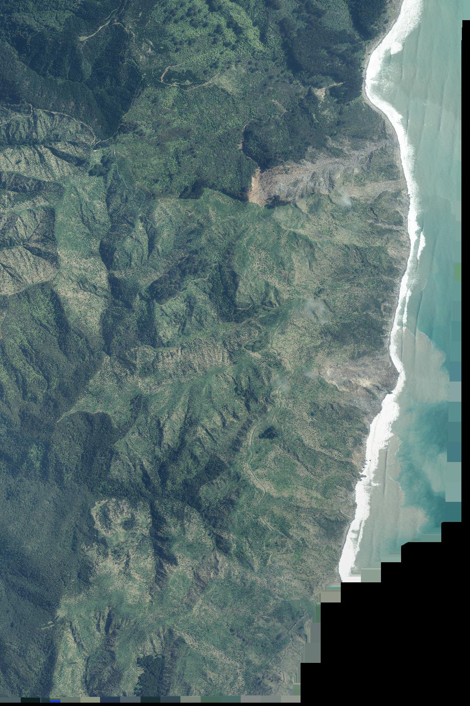

# RGB values with webp Lossless compression with GDAL <= 3.7.0

LINZ stores its Aerial Imagery as lossless WebP as it provides the best storage size for lossless RGB(A) imagery.

When creating tiffs using WebP Lossless compression and GDAL <= 3.7.0, to improve compression levels the webp encoder will write invalid values into the R, G and B values when the pixel is full alpha.

What this means is anywhere `alpha = 255` the `R` `G` and `B` values are not to be trusted and should be `0`

With the alpha layer disabled the invalid RGB values can be seen on the right side of the imagery.

This was fixed in [osgeo/gdal#8038](https://github.com/OSGeo/gdal/issues/8038) and the imagery archive may in the future be recompressed to set the RGB values to `0`.