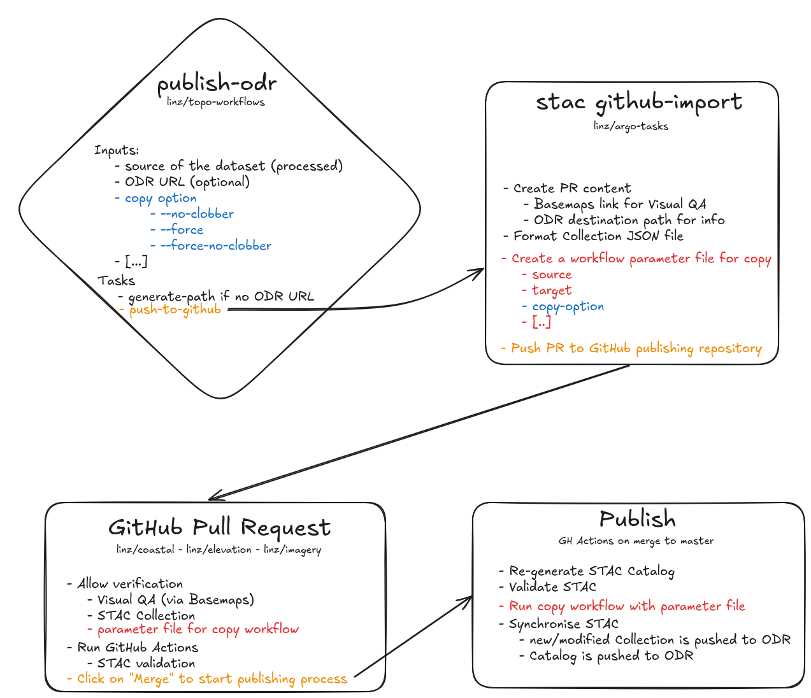

# Publishing

This document describes our system that publishes data, from the verified supplied data to publication into the [AWS Registry of Open Data](https://registry.opendata.aws/).
It does not describe the amazing job that our data analysts do prior to sending the data through to the processing/publishing pipeline.

## Processing the data

Data processing is initiated by a user (data manager) triggering an [`imagery-standardising` workflow](https://github.com/linz/topo-workflows/tree/master/workflows/raster#standardising) using [Argo Workflows](https://argoproj.github.io/workflows/). This workflow standardises the data ([COGs](https://cogeo.org/)) and generates the metadata ([STAC](https://stacspec.org/)). The standardised data is initially stored in a staging/temporary location in AWS S3.

## Publishing the data

### GitHub Pull Request

A GitHub Pull Request is either triggered by the same workflow that processes the data (as an extra step), or by a stand alone workflow [`publish-odr`](https://github.com/linz/topo-workflows/tree/master/workflows/raster#publish-odr).
This workflow creates a Pull Request (PR) on this repository. This PR is used as a quality checking tool: the STAC Catalog is re-generated and the STAC Collection validated, the data can be viewed as served by [LINZ Basemaps](https://basemaps.linz.govt.nz) through the link in the PR description and the STAC Collection can be view and amended as a PR file. The PR also contains an [Argo Workflows parameter](https://argo-workflows.readthedocs.io/en/latest/walk-through/parameters/) file that will be use to copy the data to its published location. Once the data has been checked and is ready to go, the reviewer can click on the Merge button to trigger publishing the dataset to the ODR via GitHub Actions.

### GitHub Actions

The [Publish GitHub Actions (`publish.yml`)](https://github.com/linz/imagery/blob/master/.github/workflows/publish.yml) is triggered when the PR is merged to the `master` branch.
This Action, through the [`publish-odr` step](https://github.com/linz/imagery/blob/38c525f3e9f3b10c2b32753c92009f204b8ee74c/.github/workflows/publish.yml#L37), will trigger a [`copy` workflow](https://github.com/linz/topo-workflows/tree/master/workflows/storage#copy) using the parameter file of the PR to copy the dataset over the ODR bucket. [STAC Sync](https://github.com/linz/argo-tasks/tree/master/src/commands/stac-sync#stac-sync) is used to copy the Collection of the dataset separately as we want to keep this repository and the ODR bucket in sync, and the Catalog which is re-generated for each new/modified dataset (for technical purposes: updating checksum links).
