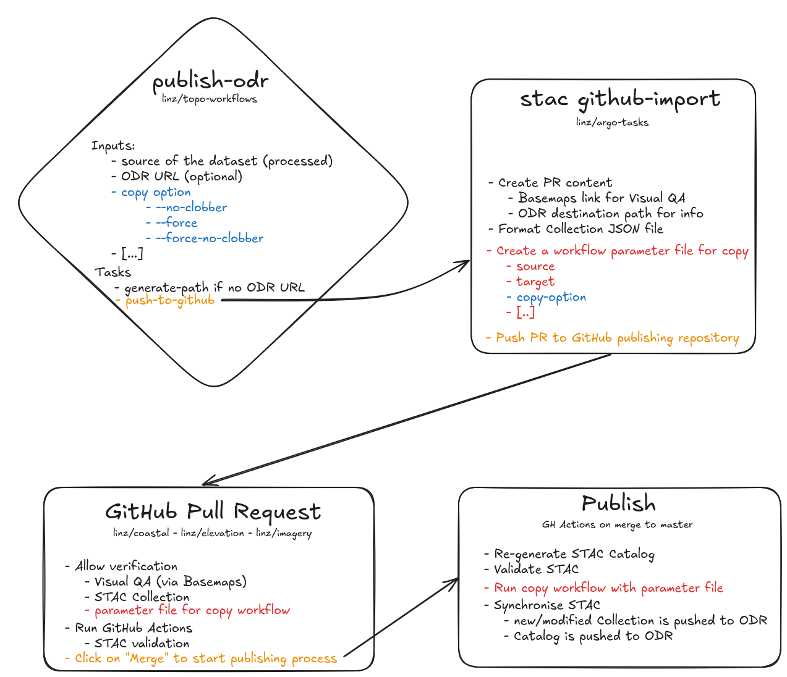

# Publishing

This documentation intends to describe our data publishing process. This process involves multiple parts of our system and it can be useful to understand how each piece is chained together to go from the data that is supplied to LINZ to the standardised data that is publicly published on the AWS Registry of Open Data (ODR - `s3://nz-imagery/`)

## Processing the data

It is initiated by a user (data manager) triggering an [`imagery-standardising` workflow](https://github.com/linz/topo-workflows/tree/master/workflows/raster#standardising) using [Argo Workflows](https://argoproj.github.io/workflows/). This workflow standardises the data (COG) and metadata (STAC). The standardised data is stored in a staging/temporary location in AWS S3.

## Publishing the data

### GitHub Pull Request

It is either triggered by the same workflow that process the data as an extra step, or by a stand alone workflow [`publish-odr`](https://github.com/linz/topo-workflows/tree/master/workflows/raster#publish-odr).
This workflow create a GitHub Pull Request on this repository. This PR is used as a quality checking tool: the STAC Catalog is re-generated and the STAC Collection validated, the data can be viewed served by [`linz/basemaps`](https://basemaps.linz.govt.nz) through the link in the PR description and the STAC Collection can be view and amended as a PR file. The PR also contains an [Argo Workflows parameter](https://argo-workflows.readthedocs.io/en/latest/walk-through/parameters/) file that will be use to copy the data to its published location. Once the data has been checked and is ready to go, the reviewer can click on the merging button to trigger publishing the dataset to the Registry of Open Data via GitHub Actions.

### GitHub Actions

The Publish GitHub Actions (`publish.yml`) is triggered when the PR is merged to the `master` branch.
This Action through the [`publish-odr` step](https://github.com/linz/imagery/blob/38c525f3e9f3b10c2b32753c92009f204b8ee74c/.github/workflows/publish.yml#L37) will trigger a [`copy` workflow](https://github.com/linz/topo-workflows/tree/master/workflows/storage#copy) using the parameter file of the PR to copy the dataset over the ODR bucket. [STAC Sync](https://github.com/linz/argo-tasks/tree/master/src/commands/stac-sync#stac-sync) is used to copy separately the Collection of the dataset as we want to keep a sync between this GH repository and the ODR bucket, and the Catalog which is re-generated for each new/modified dataset (for technical purposes: checksum links).
