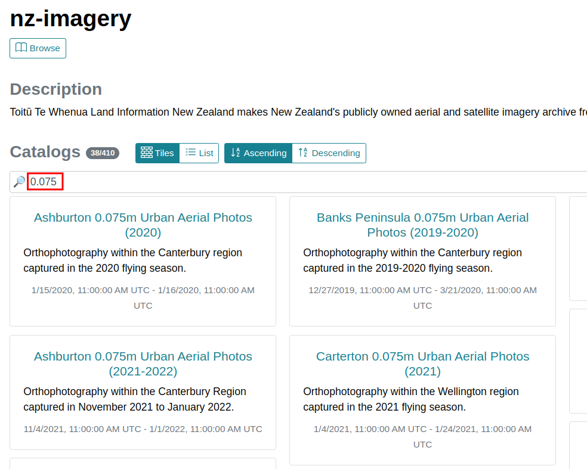
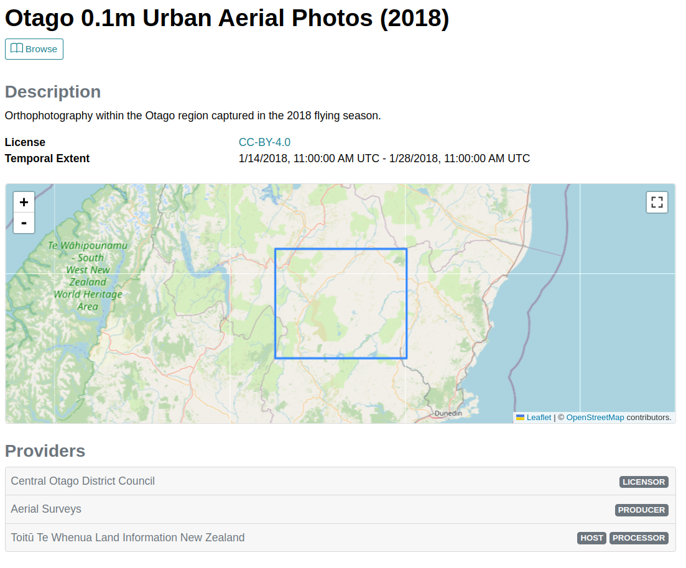

# STAC metadata

A list of tools is available on [the STAC website](https://stacspec.org/en/about/tools-resources/).

## STAC Browser

[STAC Browser](https://github.com/radiantearth/stac-browser) is a web application that provides a UI to search and view STAC metadata. It takes a Catalog or a Collection as the entrypoint to allow the user to navigate through the metadata.

To deploy STAC Browser, you can follow [this documentation](https://github.com/radiantearth/stac-browser#get-started).

For a quick start, you can use [the demo instance](https://radiantearth.github.io/stac-browser/), pass the link to the New Zealand Imagery STAC Catalog `https://nz-imagery.s3-ap-southeast-2.amazonaws.com/catalog.json` and click on the `Load` button.

### Filtering the data

The list of Collections can be filtered, in this example showing up all the `0.075m` resolution imagery:

### Viewing Collection details

Clicking on a Collection shows the details:

