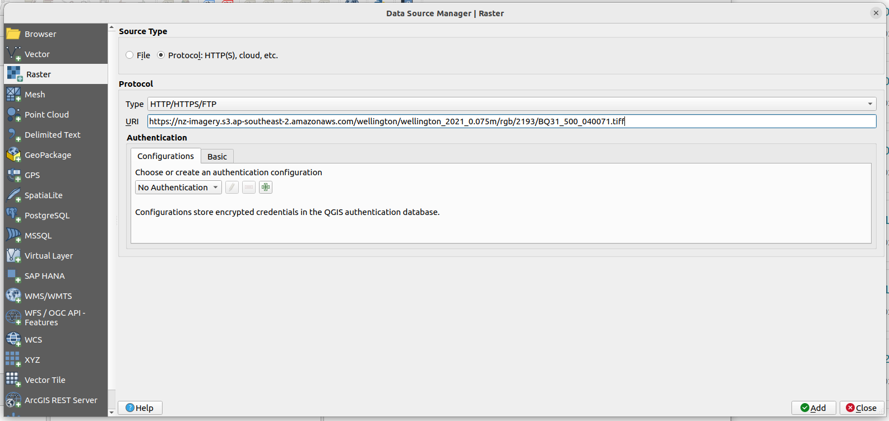
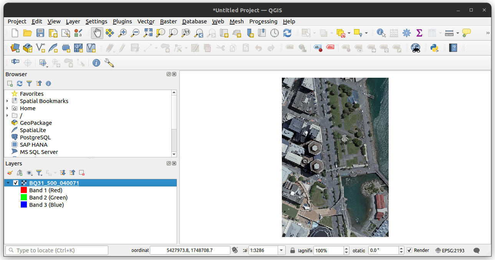

# Get the link to the TIFF

The STAC Catalog, https://nz-imagery.s3-ap-southeast-2.amazonaws.com/catalog.json, is the entry point of the LINZ imagery data. It points to the different STAC Collections representing a dataset.

> **_Note:_** The files on the AWS S3 bucket `nz-imagery` can be accessible with a `s3` path `s3://nz-imagery` or a `https` URL `https://nz-imagery.s3-ap-southeast-2.amazonaws.com/`.

## Manually navigate through the STAC Catalog to a get a TIFF

This is an example using the "Wellington 0.075m Urban Aerial Photos (2021)" dataset.

1. From `catalog.json` get the Collection link for "Wellington 0.075m Urban Aerial Photos (2021)" in the `links` list:

```json
{
  "rel": "child",
  "href": "./wellington/wellington_2021_0.075m/rgb/2193/collection.json",
  "title": "Wellington 0.075m Urban Aerial Photos (2021)",
  "file:checksum": "1220ca9a50511a2cb0f03229a4cc0342b30c57790f63d72221396942a18719efcd42",
  "file:size": 172494
}
```

2. The Collection can be accessible from this GitHub repository, `stac/wellington/wellington_2021_0.075m/rgb/2193/collection.json` or from `https://nz-imagery.s3-ap-southeast-2.amazonaws.com/wellington/wellington_2021_0.075m/rgb/2193/collection.json`. From the Collection get an Item link in the `links` list:

```json
{ "rel": "item", "href": "./BQ31_500_040071.json", "type": "application/json" }
```

3. The Item can be accessible from `https://nz-imagery.s3-ap-southeast-2.amazonaws.com/wellington/wellington_2021_0.075m/rgb/2193/BQ31_500_040071.json`. A list of assets can be found:

```json
"assets": {
  "visual": {
    "href": "./BQ31_500_040071.tiff",
    "type": "image/tiff; application=geotiff; profile=cloud-optimized",
    "file:checksum": "1220648bf40bb0b7e1996ac3f4ae52858ec417fcf0179e5f13e31ae6d071431c79f9"
  }
}

```

In this case, the TIFF can be accessible from `https://nz-imagery.s3-ap-southeast-2.amazonaws.com/wellington/wellington_2021_0.075m/rgb/2193/BQ31_500_040071.tiff`

> **_Note:_** Our TIFF files and STAC Item files use the same base name. Having the link to the STAC Item, you can determine the TIFF link by changing its suffix from `.json` to `.tiff`.

## Using STAC Browser

This tool is described in [this page](tools.md).

# GDAL

[GDAL](https://gdal.org/)

## Virtual file system

GDAL allows you to run command on a file that is not on your local machine using a virtual file systems path:

- `/vicurl/https://nz-imagery.s3-ap-southeast-2.amazonaws.com/[PATH]`
- `/vsis3/s3://nz-imagery/[PATH]`

## gdalinfo

```bash
gdalinfo /vsicurl/https://nz-imagery.s3-ap-southeast-2.amazonaws.com/wellington/wellington_2021_0.075m/rgb/2193/BQ31_500_040071.tiff
```

<details>
  <summary>Output</summary>

```
Driver: GTiff/GeoTIFF
Files: BQ31_500_040071.tiff
Size is 3200, 4800
Coordinate System is:
PROJCRS["NZGD2000 / New Zealand Transverse Mercator 2000",
    BASEGEOGCRS["NZGD2000",
        DATUM["New Zealand Geodetic Datum 2000",
            ELLIPSOID["GRS 1980",6378137,298.257222101,
                LENGTHUNIT["metre",1]]],
        PRIMEM["Greenwich",0,
            ANGLEUNIT["degree",0.0174532925199433]],
        ID["EPSG",4167]],
    CONVERSION["New Zealand Transverse Mercator 2000",
        METHOD["Transverse Mercator",
            ID["EPSG",9807]],
        PARAMETER["Latitude of natural origin",0,
            ANGLEUNIT["degree",0.0174532925199433],
            ID["EPSG",8801]],
        PARAMETER["Longitude of natural origin",173,
            ANGLEUNIT["degree",0.0174532925199433],
            ID["EPSG",8802]],
        PARAMETER["Scale factor at natural origin",0.9996,
            SCALEUNIT["unity",1],
            ID["EPSG",8805]],
        PARAMETER["False easting",1600000,
            LENGTHUNIT["metre",1],
            ID["EPSG",8806]],
        PARAMETER["False northing",10000000,
            LENGTHUNIT["metre",1],
            ID["EPSG",8807]]],
    CS[Cartesian,2],
        AXIS["northing (N)",north,
            ORDER[1],
            LENGTHUNIT["metre",1]],
        AXIS["easting (E)",east,
            ORDER[2],
            LENGTHUNIT["metre",1]],
    USAGE[
        SCOPE["Engineering survey, topographic mapping."],
        AREA["New Zealand - North Island, South Island, Stewart Island - onshore."],
        BBOX[-47.33,166.37,-34.1,178.63]],
    ID["EPSG",2193]]
Data axis to CRS axis mapping: 2,1
Origin = (1748800.000000000000000,5427960.000000000000000)
Pixel Size = (0.075000000000000,-0.075000000000000)
Metadata:
  AREA_OR_POINT=Area
Image Structure Metadata:
  COMPRESSION=WEBP
  INTERLEAVE=PIXEL
  LAYOUT=COG
Corner Coordinates:
Upper Left  ( 1748800.000, 5427960.000) (174d46'37.05"E, 41d17' 9.95"S)
Lower Left  ( 1748800.000, 5427600.000) (174d46'37.37"E, 41d17'21.62"S)
Upper Right ( 1749040.000, 5427960.000) (174d46'47.36"E, 41d17' 9.79"S)
Lower Right ( 1749040.000, 5427600.000) (174d46'47.68"E, 41d17'21.46"S)
Center      ( 1748920.000, 5427780.000) (174d46'42.37"E, 41d17'15.70"S)
Band 1 Block=512x512 Type=Byte, ColorInterp=Red
  Overviews: 1600x2400, 800x1200, 400x600, 200x300
  Mask Flags: PER_DATASET ALPHA
  Overviews of mask band: 1600x2400, 800x1200, 400x600, 200x300
Band 2 Block=512x512 Type=Byte, ColorInterp=Green
  Overviews: 1600x2400, 800x1200, 400x600, 200x300
  Mask Flags: PER_DATASET ALPHA
  Overviews of mask band: 1600x2400, 800x1200, 400x600, 200x300
Band 3 Block=512x512 Type=Byte, ColorInterp=Blue
  Overviews: 1600x2400, 800x1200, 400x600, 200x300
  Mask Flags: PER_DATASET ALPHA
  Overviews of mask band: 1600x2400, 800x1200, 400x600, 200x300
Band 4 Block=512x512 Type=Byte, ColorInterp=Alpha
  Overviews: 1600x2400, 800x1200, 400x600, 200x300
```

</details>

# QGIS

## Loading the TIFF

1. In QGIS, open the "Data Source Manager" (press `ctrl+L`)
2. Select "Protocol: HTTP(S)" as the "Source Type"
3. Select "HTTP/HTTPS/FTP" as the "Protocol Type"
4. Paste the HTTPS URL to the TIFF, for example `https://nz-imagery.s3-ap-southeast-2.amazonaws.com/wellington/wellington_2021_0.075m/rgb/2193/BQ31_500_040071.tiff`
5. Click on the "Add" button and wait for the file to load.



